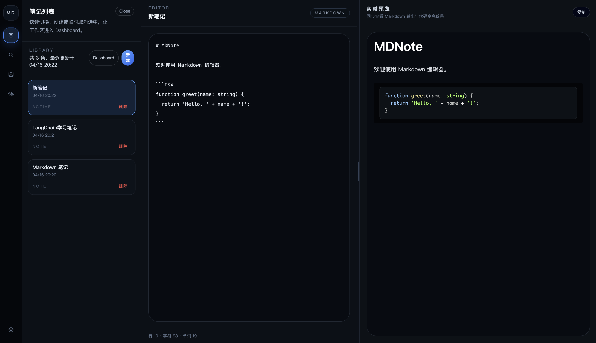

# 📝 MDNote - 极简主义 Markdown 笔记助手

[](https://opensource.org/licenses/MIT)
[](https://vitejs.dev/)
[](https://github.com/XiGua-frt)

**MDNote** 是一款专为开发者打造的轻量级、沉浸式 Markdown 笔记应用。它摒弃了冗余功能，专注于提供极致的本地写作体验，同时也是一套探索 **AI 辅助编程 (Agentic Workflow)** 的工程化实践案例。

---

## ✨ 核心特性

* **🚀 实时预览**：基于 `react-markdown` 的双栏实时渲染，所见即所得。
* **🎨 专业高亮**：集成 `react-syntax-highlighter`，支持主流编程语言的语法高亮。
* **📦 本地存储**：数据全量存储在浏览器 `LocalStorage`，隐私安全，开箱即用。
* **🔍 动态检索**：支持对笔记标题及内容的实时模糊搜索。
* **📂 多面板管理**：仿 IDE 的侧边栏设计，面板可独立开关与隐藏，最大化利用屏幕空间。
* **🛠 AI 友好**：内置 `AGENTS.md` 开发规范，完美适配 Cursor / Claude Code 等 AI 辅助工具。

---

## 🛠 技术选型

- **核心框架**: React 18 + TypeScript
- **构建工具**: Vite
- **样式方案**: Tailwind CSS
- **解析引擎**: `react-markdown` (remark/rehype 生态)
- **语法高亮**: `react-syntax-highlighter` (Theme: Atom One Dark)
- **状态管理**: 自定义 `useLocalStorage` Hooks

---

## 📸 界面预览

> *三栏自适应设计，支持面板独立隐藏*


---

## ⚡ 快速开始

```bash
# 克隆仓库
git clone https://github.com/XiGua-frt/md-note.git
# 进入目录
cd md-note

# 安装依赖
npm install

# 启动开发服务器
npm run dev

---

## 🤖 关于作者与 Agent 实验室

> **"不只是笔记工具，更是智能体工作流的实验场。"**

我是一名深耕**AI Agent** 领域的全栈开发者。本工具 MDNote 是我构建个人知识库智能体（RAG Agent）的基础设施之一。

如果你也对以下领域感兴趣，欢迎与我交流探讨：
- 🤖 **LLM Agents**: 深度研究 **ReAct**、**Plan-and-Solve** 等推理架构的落地。
- 📚 **RAG 进阶**: 针对长文档和结构化数据的检索增强生成优化。
- 🎬 **AutoMedia**: 我正在开发的自动化多媒体处理智能体框架（即将开源）。

### 📩 关注我的技术成长
**不想错过 Agent 开发的硬核干货？** 扫码关注我的公众号
1. 本项目的**详细架构设计文档**（PDF）。
2. **AI 辅助编程 (Cursor/Claude Code) 实战指南**。
3. 我个人的 **Agent & RAG 学习路径图**。

<div align="center">
  
  <br/>
  <sub>扫描上方二维码，与我一同见证 Agent 时代的到来</sub>
</div>